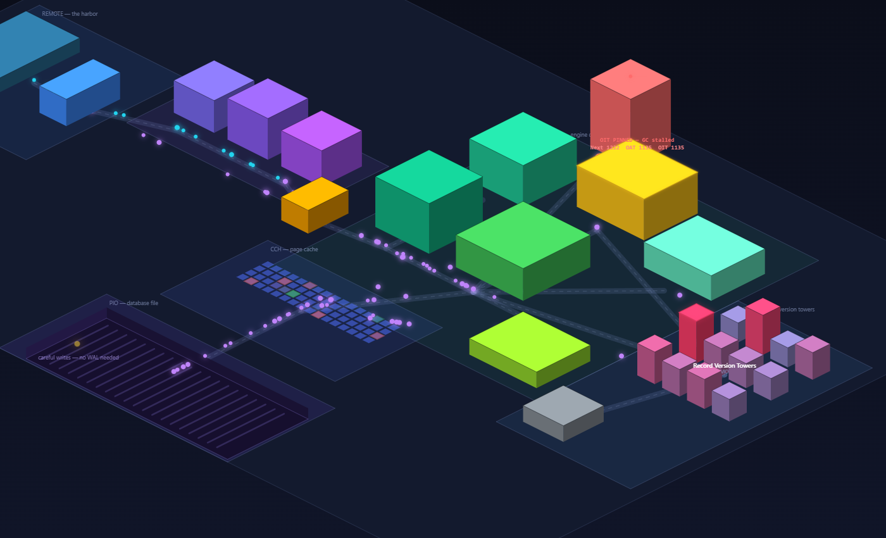

# FBSimCity

**An explorable city that shows how Firebird actually works.**

🔗 **Live: [mariuz.github.io/FBSimCity](https://mariuz.github.io/FBSimCity/)**



FBSimCity is an interactive isometric city where every building is a real
Firebird subsystem and every glowing particle is a query making its commute:
in through the client harbor, through the SQL translator, into the relational
engine, and back home carrying results. It is aimed at engineers who know SQL
but have never seen what happens *under* it — why a long-running transaction
makes a Firebird database slow down, what the famous OIT/OAT/Next counters in
`gstat -h` mean, why sweep matters, and how Firebird survives crashes without
a write-ahead log.

Inspired by [PGSimCity](https://github.com/NikolayS/PGSimCity) (the same idea
for PostgreSQL). The architectural block base comes from the paper
[**Conceptual Architecture for Firebird**](https://github.com/mariuz/conceptual-architecture-for-firebird-paper)
by Hubert Chan and Dmytro Yashkir (University of Waterloo), extended by Popa
Adrian Marius — Firebird as a top-level **pipe-and-filter** system:

```
clients ⇄ REMOTE (Y-valve) ⇄ DSQL (SQL → BLR) ⇄ JRD (engine) — LOCK manager
```

## The city map

| District / building | Subsystem | What you see |
|---|---|---|
| Client Harbor | REMOTE | Queries arrive over TCP/IP and XNET; results ship back out |
| Y-Valve Gate | Y-valve | Every attachment is dispatched to the right provider |
| Lexer, Parser, BLR Generator | DSQL | SQL particles (cyan) become BLR particles (violet) |
| Security Gatehouse | SCL | Authentication and ACLs before entering the engine |
| Metadata Library | MET | The RDB$ system tables the compiler consults |
| Compiler & Optimizer | CMP | BLR becomes an optimized execution tree |
| Execution Hall | EXE | The heart of JRD — interprets the request tree |
| B-Tree Gardens | BTR | Index retrievals with prefix-compressed keys |
| Sort Yard | SORT | External merge sort for ORDER BY / GROUP BY |
| Transaction Hall | TRA | TIP pages; live **Next / OAT / OIT** counters on the facade |
| Lock Manager Tower | LOCK | Shared-memory lock table; writers queue, deadlock victims roll back |
| Record Version Towers | VIO / MGA | Each UPDATE stacks a version; towers redden as chains grow |
| Sweep & GC Depot | GC | Cooperative GC plus the sweep truck touring the towers |
| Page Cache Plaza | CCH | Buffer slots flash green (hit) / red (miss) / yellow (dirty) |
| Database File excavation | PIO | Careful writes — no WAL — keep the file consistent |

## Things to try

- **Flip on "Long-running transaction."** The OIT pins, the sweep truck is
  not allowed to demolish anything, and the version towers grow and turn
  red — Firebird's version of bloat. Flip it off and hit **Sweep now**.
- **Shrink the page cache** to 16 pages and watch the hit ratio fall while
  queries detour down into the database-file excavation.
- **Raise the write mix** and watch lock waits climb at the tower — with the
  occasional deadlock victim sent home (red particle).
- **Rush hour ×60** floods the harbor with a burst of queries.
- Take the **guided tour** for a narrated walk down the pipeline.

## What it is (and isn't)

The simulation implements honest scaled-down mechanics: multi-generational
record versions with chains per table, Next/OAT/OIT marker arithmetic,
cooperative garbage collection plus interval sweep, an LRU page cache over a
skewed page-access distribution, and lock waits with deadlock rollbacks.
Numbers are scaled so changes stay human-observable.

It is **not** an emulator: no SQL is parsed, no Firebird code runs in your
browser, and plenty of subtlety (commit-order snapshots, precedence graphs of
careful writes, savepoints, two-phase commit…) is simplified. Treat it as
intuition, not documentation — corrections welcome via issues and PRs.

## Running locally

No build step, no dependencies — plain HTML, CSS and JavaScript on a 2D
canvas. Serve the directory with any static server:

```bash
python -m http.server 8000
```

then open <http://localhost:8000/>.

## Code layout

- `js/data.js` — the world: buildings, districts, descriptions (from the
  paper), roads, tour script
- `js/sim.js` — the Firebird behavioral model (no rendering)
- `js/render.js` — isometric canvas renderer (*structure is matte, meaning
  is neon*)
- `js/ui.js` — control room, stats bar, info panel, guided tour
- `js/main.js` — camera, input, main loop

## Credits

- Architecture: [Conceptual Architecture for Firebird](https://github.com/mariuz/conceptual-architecture-for-firebird-paper)
  — Hubert Chan & Dmytro Yashkir, updated and extended by Popa Adrian Marius
- Idea & inspiration: [PGSimCity](https://github.com/NikolayS/PGSimCity) by
  Nikolay Samokhvalov
- [Firebird](https://firebirdsql.org/) — the wonderful database this city
  is a scale model of

## License

MIT — see [LICENSE](LICENSE).
